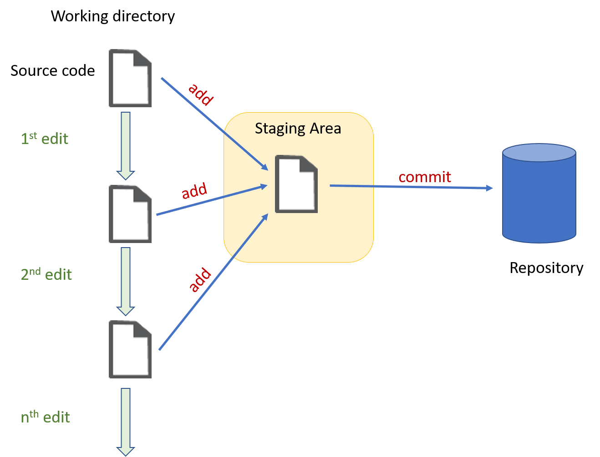

# git คืออะไร
  git เป็นโปรแกรมควบคุมเวอร์ชัน (Version control) ตัวหนึ่่ง ที่ทำงานในลักษณะ distribute มีหน้าที่จัดเก็บและควบคุมการเปลี่ยนแปลงที่เกิดขึ้นกับไฟล์ นับตั้งแต่การเปลี่ยนแปลงเล็กๆ น้อยๆ ไปจนเปลี่ยนแปลงทั้งไฟล์ เช่น เพิ่ม ลบ หรือ เปลี่ยนชื่อไฟล์ 

  โดยทั่วไป โปรแกรมเมอร์มักจะใช้ git สำหรับการเก็บไฟล์ต้นฉบับ (source code) แต่จริงๆ แล้ว git นั้นสามารถเก็บไฟล์ได้ทุกรูปแบบ ทั้งไฟล์ชนิด Text file และ Binary File

### ระบบควบคุม version หรือที่เรียกว่า version control นั้นไม่ได้มีแค่ git เพียงตัวเดียวเท่านั้น  ```ให้นักศึกษาค้นคว้าเพิ่มเติมว่ามีอะไรบ้าง```


# เหตุผลที่ควรใช้ git
## 1. ใช้เพื่อติดตามการเปลี่ยนแปลงของ source code
### ___ก่อนจะมี version control___

* ในการพัฒนาซอฟต์แวร์นั้น เลี่ยงไม่พ้นที่ต้องมีการพัฒนาเป็นโปรแกรมย่อยๆ ซึ่งเก็บแยกจากกันในหลายๆ ไฟล์ และต้องมีการแก้ไขไฟล์ต้นฉบับหลายครั้ง จนกว่าซอฟต์แวรจะบรรลุวัตถุประสงค์ในการสร้าง 

    * หากมีการเปลี่ยนแปลงใดๆ ที่ส่งผลให้เกิดการทำงานที่ผิดหรือแย่ลงกว่าเดิม โปรแกรมเมอร์ก็จำเป็นต้องย้อนกลับไปยัง source code รุ่นก่อนหน้า โดยควรจะต้องออกแรงน้อยที่สุด

* ในอดีต (ยุคทึ่ระบบปฏิบัติการรองรับชื่อไฟล์เพียงแค่ 8 ตัวอักษร) โปรแกรมเมอร์ จะทำการ print out ตัว source code  ออกมาบนกระดาษ เพื่อไว้ตรวจสอบและติดตามการเปลี่ยนแปลง นับเป็นการสิ้นเปลืองทรัพยากรเป็นอย่างมาก

* เมื่อเทคโนโลยีการจัดเก็บข้อมูลก้าวหน้าขึ้น โดยเฉพาะในยุคที่ระบบผฏิบัติการที่รองรับชื่่อไฟล์ที่มีความยาวมากขึ้น (อาจจะมากถึง 256 ตัวอักษรและไม่จำกัดขนาดตัวอักษร) โปรแกรมเมอร์ก็อาจจะเลือกที่จะเปลี่ยนชื่อไฟล์ ตามวันเวลาที่แก้ไข หรือตามประเด็นหลักๆ ที่แก้ไขไฟล์นั้น เช่น

    display_21090814.c <br> 
    display_21090815.c <br>
    display_21090822.c 
    
    หรือ 

    display_add_delay_time.c

    เป็นต้น 

    ทั้งนี้ก็เพื่อให้รู้ว่าวันที่ล่าสุดที่แก้ไขไฟล์นั้นคือเมื่อใด หรือเหตุผลในการแก้ไฟล์นั้นคื่ออะไร และถ้าหากต้องการจะย้อน version กลับไป ก็สามารถไล่ดูตามวันเวลาที่เปลี่ยนแปลงข้อมูลใน source code  และมักจะเขียน comment ยาวๆ ไว้ใน source code เพื่อเป็นการจดบันทึกประวัติการแก้ไข


### ___ยุคของ git___

แนวคิดของ git นั้นก็คือ เป็นระบบที่จัดเก็บข้อมูลและติดตามการเปลี่ยนแปลงที่สามารถย้อนกลับไปยังเวอร์ชั่นใดๆ ก่อนหน้าได้ตามต้องการ สามารถดูรายละเอียดในการเปลี่ยนแปลง ไม่ว่าจะเป็นวันเวลา เหตุผลในการเปลี่ยนแปลง รวมทั้งสามารถดูได้ว่า ใครเป็นคนเปลี่ยนแปลงไฟล์นั้น

เพื่อให้เข้าใจได้ง่ายขึ้น ให้พิจารณารูปที่ 1  


<p align="center">   </p>
<p align="center"> <b>รูปที่ 1</b> แนวคิด version control</p>

## ```หมายเหตุ รูปที่ 1 ใช้เพื่ออธิบายแนวคิดในการทำงานของ version control ยังไม่ครบกระบวนการทั้งหมดของ git ```

จากรูปที่ 1 สามารถอธิบายอย่างง่ายๆ ได้ดังต่อไปนี้
1. ผู้ใช้สร้าง source code ขึ้นมา 1 ไฟล์ แล้วเพิ่มเข้าสู่ working directory (ที่ถูกเฝ้ามองโดย git)

2. ผู้ใช้เพิ่มไฟล์ source code เข้าสู่ staging area   
2.1 git จะทำการวิเคราะห์ความแตกต่างระหว่างไฟล์ที่เพิ่มเข้ามา เทียบกับการแก้ไขครั้งก่อน  
2.2 ในกรณีนี้เป็นการ add ครั้งแรก git ก็จะนำไฟล์ใหม่ทั้งไฟล์ไปเก็บใน staging area  
2.3 ถ้าผู้ใช้สั่ง commit ในขั้นตอนนี้  git ก็จะเก็บไฟล์ลงใน repository ทันที

3. ผู้ใช้แก้ไข source code ครั้งที่ 1 และบันทึก  
3.1 git พบว่ามีการเปลี่ยนแปลงเกิดขึ้น (โดยอัตโนมัติ) เนื่องมาจากเวลาของไฟล์ที่ git เฝ้ามอง กับเวลาของไฟล์ที่เก็บไว้ใน staging  area มีความแตกต่างกัน  
3.2 ในขั้นตอนนี้ ถ้าเราเรียกดูสถานะของ git ก็จะมีการรายงานออกมาว่ามีไฟล์ถูกแก้ไข  
3.3 ทุกครั้งที่มีการบันทึกไฟล์ git จะรู้ทันทีว่ามีความแตกต่างเกิดขึ้น เพราะการบันทึกไฟล์ ส่งผลให้เวลาประทับของไฟล์ (time stamp) เปลี่ยนไป 

4. ผู้ใช้ทำการ add ไฟล์ที่ถูกแก้ไขครั้งที่ 1 เข้าสู่ staging area  
4.1 git จะวิเคราะห์ความแตกต่างระหว่างสิ่งที่มีอยู่เดิมใน staging area และ ไฟล์ที่ผู้ใช้ add เข้ามา (เป็นครั้งที่ 2) ได้ผลลัพธ์เป็นผลต่างระหว่างไฟล์ทั้งสองรุ่น  <br>
__บรรทัดไหนที่ถูกเพิ่มเข้ามา git จะกำกับด้วยเครื่องหมาย (+)__<br>
__บรรทัดไหนที่ถูกลบออกไป git จะกำกับด้วยเครื่องหมาย (-)__  
4.2 ผู้ใช้สามารถแก้ไข บันทึก source code และ add ไปยัง staging area ได้เรื่อยๆ แต่การเปลี่ยนแปลงจะไม่ถูกเก็บลงใน repository จนกว่าจะสั่ง commit ``(ข้อควรระวัง ในกรณีนี้ ไม่ถือว่าเป็นการติดตามการเปลี่ยนแปลงของไฟล์อย่างสมบูรณ๊)``

5. ผู้ใช้สั่ง commit เพื่อบันทึกการเปลี่ยนแปลงไปยัง repository  
5.1 git จะบันทึก เฉพาะส่วนต่าง ลงใน repository  (ทั้งที่เกิดจากการเพิ่มและลบบรรทัดใน source code)ดังนั้นเนื้อที่ที่จะใช้สำหรับเก็บข้อมูลลงใน repository เพิ่มในแต่ละรุ่นที่เปลี่ยนไปจึงมีขนาดที่น้อยมาก เมื่อเทียบกับขนาด source code 
6. ในการแก้ไขครั้งต่อๆ ไป รวมถึงการ add จะเกิดขึ้นในลักษณะเดียวกัน 

***
### ``การใช้ git ตามรูปที่ 1 มีข้อดีอย่างหนึ่งคือ สามารถทำงานได้โดยไม่ต้องต่อกับ internet เนื่องจาก repository ตั้งอยู่ในเครื่องของผู้ใช้งาน git``
***
## 2. ใช้เพื่อการทำงานเป็นทีม

TODO เพิ่มเนื้อหา
เพิ่มรูปภาพ working-dir, staging, local repo, remote repo, 
multiple users 