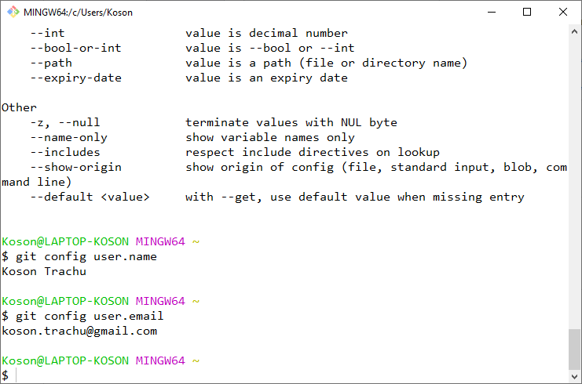

# การทดลองที่ 1 การใช้งาน Repository เบื้องต้น

## **วัตถุประสงค์**

1. เพื่อให้ผู้เรียนรู้และเข้าใจแนวคิดในการใช้ Repository 
2. เพื่อให้ผู้เรียนสามารถใช้ Repository (Github) เบื้องต้นได้

## **ทฤษฎีก่อนการทดลอง**

***Git***
---
__Git__ เป็นระบบควบคุมเวอร์ชัน (Version control systems) แบบ open source เป็นเครื่องมือที่ใช้บริหารจัดการการเปลี่ยนแปลงของไฟล์ต่างๆ ใน project การบันทึกการแก้ไขไฟล์แต่ละครั้งจะเรียกว่ารุ่น (revision) ซึ่งแต่ละรุ่นของการเปลี่ยนแปลงจะถูกกำกับด้วยการประทับเวลา (timestamp) และบุคคลที่ทำการเปลี่ยนแปลง ดังนั้น หากเกิดความผิดพลาดหรือเสียหายจากการแก้ไข เราก็จะสามารถย้อนเวลากลับไปยังการแก้ไขครั้งก่อนๆ ที่สมบูรณ์ได้ตามต้องการ ถือได้ว่าระบบควบคุมเวอร์ชันเป็นระบบพื้นฐานที่นิยมใช้ในการบริการจัดการ source code ของโปรแกรม ซึ่งจริงๆ แล้ว เราสามารถใช้ระบบควบคุมเวอร์ชันกับไฟล์ชนิดใดๆ หรืองานชนิดใดๆ ก็ได้ ไม่เฉพาะ source code ของโปรแกรมเท่านั้น  
ในปัจุบัน มีระบบควบคุมเวอร์ชันให้เลือกใช้หลากหลาย ทั้งเป็นแบบฟรีและมีค่าใช้จ่าย (เช่น  Git, Mercurial, Subversion) โดย Git จะได้รับความนิยมมากกว่าชนิดอื่นๆ  การทำงานของ Git นั้นจะมีพื้นที่เก็บไฟล์ ซึ่งเรียกว่า  repositories ซึ่งเราสามารถติดตั้งบริการ git บน server ใดๆ ก็ได้ แต่ server บริการ git ที่ได้รับความนิยมในปัจจุบันได้แก่ Github, Gitlab, Bitbucket เป็นต้น ข้อดีของการใช้ server รวมก็คือ สามารถแบ่งปันและร่วมมือ ช่วยเหลือกันในแก้ไขโปรแกรมได้จากทุกคนทั่วโลก ลักษณะเฉพาะอย่างหนึ่งของ Git ก็คือ ใน folder ที่ชื่อ .git บนคอมพิวเตอร์ของเราจะเก็บทุกสิ่งที่เก็บบน server จึงมั่นใจได้ว่า เราสามารถทำงานกับระบบควบคุมเวอร์ชันได้ทั้งแบบออนไลน์และออฟไลน์ และหากเกิดกรณีที่ repository บน server เสียหาย เราก็สามารถนำทุกอย่างที่เก็บบนเครื่องกลับขึ้นไปเก็บบน server ได้

***Github***
---
Github เป็นบริษัทหนึ่ง ที่ให้บริการ Git repository บนพื้นฐานของเว็บ (web-based Git repository hosting)  โดย Github จะให้พื้นที่เราสร้าง repository สำหรับโปรเจค ให้บริการฟังก์ชันการทำงานพื้นฐานของระบบ git เช่น การ branches, merges, และ commits อีกทั้งยังให้พื้นที่สำหรับแจ้งข้อผิดพลาด บัก หรือความต้องการเพิ่มเติม features ต่างๆ ตลอดจนมีความสามารถในการเขียนคำอธิบายแบบ wiki ใน repository นั้นๆ ด้วย  Github เป็นบริษัทที่มีมูลค่าประมาณ 2 พันล้าน USD, มีผู้ใช้ประมาณ 20 ล้านคน มี repositories ประมาณ 40 ล้าน และในจำนวนเหล่านั้น มีโปรเจคที่สำคัญมากรวมอยู่ด้วย เช่น  kernel ของ Linux , source code ของ dotnet framework จากไมโครซอฟท์ และอื่นๆ  ทำให้มีความมั่นใจในระดับหนึ่งว่าถ้า Github เกิดล่มขึ้นมา ก็จะมีเพื่อนร่วมชะตากรรมอีกไม่น้อย 

## **ขั้นตอนการทดลอง**
----

## __1. เริ่มใช้งาน Github__

ในการใช้งาน Github เราจะต้องมีบัญชีผู้ใช้ของ Github ซึ่งทาง Github จะให้บริการฟรีแบบไม่จำกัดจำนวน repository ซึ่งจะเป็นแบบ public หรือ private ก็ได้   repository  แบบ public นั้น จะสามารถมองเห็นได้จากทุกคน ส่วน repository ที่เป็นแบบ private เราจะสามารถกำหนดบุคคลที่อนุญาตให้เห็น repository ของเราได้ ซึ่งจะสะดวกในการทำ project ที่เป็นความลับ      

### __1.1 สร้างบัญชีผู้ใช้งานบน Github__

การสร้างบัญชีผู้ใช้บน Github ให้ไปที่ ___https://github.com/join___ จากนั้น ให้กรอกรายละเอียด ซึ่งชื่อผู้ใช้ ___(User name)___ จะถูกนำไปใช้ในหลายๆ ที่ ดังนั้นควรเป็นชื่อที่จำง่ายและพิมพ์ได้สะดวก มิฉะนั้นจะเสียเวลาในการทำงาน    

<p align="center">   </p>
<p align="center"> <b>รูปที่ 1-1</b> การสร้างบัญชี Github </p>

### __1.2 ติดตั้งโปรแกรม Git__

__1.2.1__ ดาวน์โหลดโปรแกรม Git จาก ___https://git-scm.com/downloads___ โดยเลือกโปรแกรมติดตั้งให้ตรงกับระบบปฏิบัติการที่ใช้  โปรแกรมที่ดาวน์โหลดมา จะมี GUI ให้เราใช้งานด้วยซึ่งมีชื่อเรียกว่า Github desktop แต่ถ้าหากสนใจที่จะใช้ Git GUI Clients ตัวอื่นๆ ก็สามารถศึกษาได้ที่  ___https://git-scm.com/downloads/guis___

__1.2.2__ ติดตั้งโปรแกรม Git ตามคำแนะนำของโปรแกรมติดตั้ง

__1.2.3__ เปิดโปรแกรม Git bash จะได้หน้าต่าง terminal ที่ทำงานใน text mode


<p align="center">   </p>
<p align="center"> <b>รูปที่ 1-2</b> หน้าต่าง terminal ของ git bash</p>

__1.2.4__ ทดสอบว่าสามารถใช้งาน Git บนเครื่องของเราได้หรือไม่ ให้พิมพ์คำสั่งต่อไปนี้

    $ git

ถ้า terminal ตอบกลับมาว่าไม่รู้จักคำสั่ง `git` แสดงว่าการติดตั้งยังไม่สมบูรณ์ ให้กลับไปตรวจสอบขั้นตอน 1.2.2 ให้ติดตั้งเรียบร้อย

<p align="center">   </p>
<p align="center"> <b>รูปที่ 1-3</b> ผลการทดลองพิมพ์คำสั่ง `git`</p>

__1.2.5__ บอกให้ Git รู้จักชื่อของเรา โดยพิมพ์คำสั่งต่อไปนี้ 

    $ git config --global user.name “USER NAME”

ในกรณีที่เราต้องการทราบชื่อผู้ใช้ปัจจุบัน สามารถสั่งให้ Git รายงานออกมาด้วยการพิมพ์คำสั่งต่อไปนี้

    $ git config user.name
<p align="center">   </p>
<p align="center"> <b>รูปที่ 1-4</b> git config --global user.name `git`</p>

__1.2.6__ บอกให้ Git รู้จัก email ของเรา  โดยพิมพ์คำสั่งต่อไปนี้

    $ git config --global user.email “USER EMAIL ADDRESS”

ในกรณีที่เราต้องการทราบชื่อผู้ใช้ปัจจุบัน สามารถสั่งให้ Git รายงานออกมาด้วยการพิมพ์คำสั่งต่อไปนี้

    $ git config user.email

__หมายเหตุ__  
___email___ ที่ใช้จะต้องตรงกับ email ที่ลงทะเบียนไว้กับ Github มิฉะนั้นจะไม่สามารถเขียนข้อมูลขึ้นไปบน server ได้
เมื่อทำในขั้นตอน 1.2.5 และ 1.2.6 เรียบร้อยแล้ว การทำงานใดๆ บน Github ก็จะปรากฏชื่อและ Email ของเรากำกับไว้เสมอ 

<p align="center">   </p>
<p align="center"> <b>รูปที่ 1-5</b> git config --global user.email</p>

### __1.3 สร้าง repository (บน server)__
Repository เป็นพื้นที่สำหรับเก็บ project ของเรา ซึ่งไม่ได้หมายความถึงเฉพาะ source code เท่านั้น repository ยังสามารถประกอบด้วยไฟล์ทุกชนิด ไม่ว่าจะเป็น Word Document, spread sheet, presentation, เอกสารการออกวิเคราะห์และออกแบบซอฟต์แวร์ ไฟล์มีเดียภาพและเสียง รวมไปถึงเอกสาร Wiki ในลักษณะ html ด้วย ดังนั้น ในการทำโครงการพัฒนาซอฟต์แวร์ เราสามารถนำทุกสิ่งที่จำเป็นสำหรับการทำงาน มาใส่ไว้ใน repository  และเมื่อเพื่อนร่วมทีมหรือ user ใดๆ ทำสำเนา repository ของเราไป เขาก็จะได้ทุกสิ่งทุกอย่างไปอย่างครบถ้วน ดังนั้นจึงอาจพูดได้ว่าเราสามารถใช้ repository เป็นเครื่องมือบริหารโครงการที่มีประสิทธิภาพได้เช่นกัน  

__1.3.1 การสร้าง repository บน Github__

การสร้าง repository บน Github สามารถสร้างได้หลายวิธีด้วยกัน เช่น

***(1)*** การสร้าง repository โดยการคลิกที่ปุ่มเครื่องหมาย “+” ที่ด้านบนขวาของหน้าเพจ  Github แล้วเลือก  new repository 
 
 
<p align="center">   </p>
<p align="center"> <b> รูปที่ 1-6</b>การสร้าง repository โดยการคลิกที่ปุ่มเครื่องหมาย “+” </p>


***(2)*** การสร้าง repository โดยการคลิกที่ปุ่ม New สีเขียว 
 
<p align="center">   </p>
<p align="center"> <b>รูปที่ 1-7 </b> การสร้าง repository โดยการคลิกที่ปุ่ม New </p>

***(3)*** การสร้าง repository โดยการไปที่ ___https://github.com/new___
นอกจาก 3 วิธีข้างต้น ซึ่งจะพาเราไปสร้าง repository บนเว็บแล้ว เรายังสามารถสร้าง repository โดยใช้ command line บน terminal (ศึกษาได้จาก `adding-an-existing-project-to-github-using-the-command-line`)

__1.3.2 กำหนดชื่อและชนิดของ repository__

การใช้วิธีการ 3 วิธีแรก ในข้อ 1.3.1 จะได้ผลอย่างเดียวกัน คือ Github จะพามาหน้าสำหรับสร้าง repository

ในช่อง __Repository name__ ให้ใส่ชื่อของ _repository_ เนื่องจากบ่อยครั้งที่เราต้องใช้งานคำสั่งต่างๆ บน terminal ซึ่งต้องพิมพ์ชื่อ repository เอง ดังนั้นชื่อของ repository จะต้องมีความหมายในตัว เข้าใจง่าย กระชับ
ในช่อง Description (optional) เพิ่มคำอธิบายสั้นๆ เกี่ยวกับ repository เพื่อให้ชาวโลกอ่านแล้วเห็นภาพรวมของ  repository ได้อย่างรวดเร็ว  
ชนิดของ repository นั้น ถ้าหากเป็นโปรเจคที่เป็นความลับ ไม่อาจเปิดเผยต่อชาวโลกได้ เช่นประกอบด้วยฐานข้อมูลในงานวิจัย คะแนนแล็บของนักศึกษา ชื่อ URL, user name, password ที่เขียนลงไปใน source code  เราก็อาจจะเลือกเป็น private ซึ่งอาจจะต้องมีค่าใช้จ่ายในการสมัครสมาชิกพิเศษ หรือไม่ก็ต้องเป็น academic account ในที่นี้ให้เลือกเป็น public 

ทำเครื่องหมาย ☑ หน้าข้อความ Initialize this repository with a README เพื่อให้เราสามารถเขียนบรรยายคร่าวๆ เกี่ยวกับ repository ได้
เลือกว่าจะเพิ่ม `.gitignore` หรือ `license file` ด้วยหรือไม่ โดย `.gitignore` นี้จะบอก Git ว่าไม่ต้องสนใจที่จะติดตามไฟล์ชนิดใดบ้าง โดย Git จะกำหนดชนิดของไฟล์ให้เบื้องต้น เช่น ถ้าเราเลือก .gitignore เป็น ภาษา C++ แล้ว Git จะเพิ่มชนิดของไฟล์ต่างๆ ที่เป็นผลจากการคอมไพล์ไว้ในรายการที่เพิกเฉย (เช่น ไฟล์ที่มีนามสกุล .exe)  ซึ่งไฟล์เหล่านั้น มักจะเกิดจากการคอมไพล์โปรแกรม ไม่ใช่ไฟล์ที่เราเป็นคนแก้ไข source code จึงไม่จำเป็นที่จะต้องนำไปเก็บบน repository ให้สิ้นเปลืองพื้นที่ สามารถดูเทมเพลตของ `.gitignore` ได้จาก `A collection of useful .gitignore templates`

# `หมายเหตุ`

__ในภาพตัวอย่าง จะเป็น CL60 ให้นักศึกษาใช้เลขตามรหัสนักศึกษาของตนเองแทน เช่น ถ้ารหัสนักศึกษาขึ้นต้นด้วย 61 ก็ให้ใช้  CL61-01 เป็นต้น__

 
<p align="center">   </p>
<p align="center"> <b>รูปที่ 1-8</b> การสร้าง repository </p>

 __ผลการทดลอง__
<p align="center">   </p>


คลิกปุ่ม __Create repository__ สีเขียว

Github  จะสร้าง repository ให้ตามต้องการ

<p align="center">   </p>
<p align="center"> <b>รูปที่ 1-9 </b>repository ที่ได้จากการสร้างในข้อ 1.3</p>

__`หมายเหตุ ให้เปิดหน้าเพจนี้ค้างไว้ เพราะเราต้องมาดูผลการเปลี่ยนแปลงในภายหลัง`__


### __1.4 สร้าง git บนเครื่องคอมพิวเตอร์ (Local)__

Repository ที่สร้างขึ้นในข้อ 1.3 นั้น เป็น repository ที่อยู่บน server ในขณะที่เรากำลังแก้ไข source  code  ซึ่งมักจะเป็นการแก้ไขเล็กๆ น้อยๆ การทำงานของ git จะเน้นทำงานที่ local เป็นหลัก ต่อเมื่อเราได้พัฒนา source code จนถึงจุดหนึ่ง ที่คิดว่าสามารถเผยแพร่ เพื่อการทดสอบหรือใช้งาน เราจึงส่งขึ้นไปเก็บบน  server
การทำสำเนาของ repository มาไว้บนเครื่อง (local)  สามารถทำได้หลายวิธี ซึ่งเบื้องต้นนี้ เราจะศึกษาโดยการใช้งาน command line ซึ่งอาจจะพบกับความยุ่งยากบ้างในตอนแรกๆ แต่เมื่อใช้บ่อยๆ จนชำนาญจะพบว่ามีความยืดหยุ่นสูงกว่าการใช้ GUI Clients หรือเมื่อศึกษาจนเข้าใจแล้วหันไปใช้ GUI Clients ก็จะสามารถเข้าใจถึงการทำงานของระบบ Git อย่างแท้จริง\

__1.4.1 การ clone repository ด้วย command line (git bash)__

**การเตรียมการเบื้องต้น**

ในหน้าต่าง git bash ให้พิมพ์คำสั่ง list ดูรายการของไฟล์และโฟลเดอร์ 

    $ ls

เราจะเห็นรายการไฟล์ถูกแสดงขึ้นมา
สร้างโฟลเดอร์สำหรับเก็บงานในวิชาการทดลอง (ในที่นี้ชื่อว่า CL2560 ย่อมาจาก Computer Laboratory 2560) โดยใช้คำสั่ง 

    $ mkdir CL2560

ย้ายเข้าไปอยู่ในโฟลเดอร์ที่สร้างขึ้น โดยใช้คำสั่ง

    $ cd CL2560

สังเกตุได้จาก  git bash จะแสดงชื่อของโฟลเดอร์ปัจจุบันเป็นดังรูป

<p align="center">   </p>
<p align="center"> <b>รูปที่ 1-10</b> หน้าต่าง terminal ของ git bash เตรียมพร้อมสำหรับการ clone</p>

การทำสำเนา repository มาไว้บนเครื่องโดยการ clone
ทำสำเนา repository มาไว้บนเครื่องโดยใช้คำสั่งที่มีรูปแบบดังต่อไปนี้

    $ git clone https://github.com/[YOUR USERNAME]/[YOUR REPOSITORY NAME]

___`[YOUR USERNAME]`___ คือ username ของเราบน github

___`[YOUR REPOSITORY NAME]`___ คือชื่อ repository ของเราที่สร้างในข้อ 1.3 

ถ้าจำไม่ได้ ก็ไม่เป็นไร ให้เข้าไปที่ repository ที่เพิ่งสร้างบน Github  ___(ดูรูปที่ 1-9)___ จะเห็นว่ามีปุ่ม [__Clone or download__] สีเขียว ให้กดเบาๆ จะได้ผลดังรูปที่ 11 ให้เรากดปุ่ม copy ที่อยู่ด้านขวามือของ url  
 
<p align="center">   </p>
<p align="center"> <b>รูปที่ 1-11</b>URL สำหรับการ clone repository</p>

เมื่อทำการ clone เรียบร้อย จะได้ผลดังรูปที่ 1-12

<p align="center">   </p>
<p align="center"> <b>รูปที่ 1-12</b> ผลการ clone repository</p>

เรียกดูรายการโฟลเดอร์ (ด้วยคำสั่ง `ls`) และเปลี่ยนโฟลเดอร์ (ด้วยคำสั่ง change directory :`cd`)

ตอนแรกจะพบว่ามีโฟลเดอร์ชื่อ CL60-01 ซึ่งถูก clone มาจาก server จึงย้ายเข้าไปในโฟลเดอร์นั้น แล้วจึงสั่ง ls เพื่อดูรายการไฟล์ พบว่ามีรายการดังรูปที่ 1-13

<p align="center">   </p>
<p align="center"> <b>รูปที่ 1-13 </b>ไฟล์ที่ถูก clone มาจาก repository</p>

ทดลองเรียกดูเนื้อหาของไฟล์ โดยใช้คำสั่ง `cat`

<p align="center">   </p>
<p align="center"> <b>รูปที่ 1-14</b>เนื้อหาของไฟล์ ที่ถูก clone มาจาก repository</p>

### __1.5 การแก้ไขงานและบันทึกการเปลี่ยนแปลงบน local computer__

ถึงตอนนี้ เนื้อหาในไฟล์ README.md บน server และ local computer จะเหมือนกันทุกประการ เนื่องจากเป็นการ clone มาและยังไม่ได้ทำการแก้ไขใดๆ อีกทั้งเรามั่นใจว่าไม่มีผู้ใช้คนอื่นๆ กำลังแก้ไขงานของเราบน server  (ซึ่งการแก้ไขงานร่วมกันบน server จะอยู่ในการทดลองถัดไป)  เราสามารถแก้ไขและทำ revision ของเอกสารได้ตามต้องการ โดยการเปลี่ยนแปลงต่างๆ จะเกิดขึ้นบนเครื่อง  local computer เท่านั้น

__1.5.1 ทดลองแก้ไขไฟล์ README.md__

โดยส่วนใหญ่ ในการเขียนโปรแกรม มักจะกระทำบนโปรแกรม Integrated development environment หรือเรียกสั้นๆ ว่า IDE แต่ในการทดลองนี้ จะใช้โปรแกรมแก้ไขเอกสารอย่างง่ายๆ นั่นคือโปรแกรม Notepad.exe 
ให้พิมพ์คำสั่งต่อไปนี้ลงใน  git bash

    $ notepad README.md

ระบบจะเปิด text editor ที่มากับระบบปฏิบัติการ Windows ดังรูปที่ 15

<p align="center">   </p>

<p align="center"> <b>รูปที่ 1-15 </b> การใช้โปรแกรม notepad.exe แก้ไขไฟล์ README.md</p>

แก้ไขไฟล์ README.me  ใน notepad  โดยเพิ่มข้อความลงไปดังตัวอย่าง (ให้นักศึกษาใส่ชื่อตนเอง)

<p align="center">   </p>

<p align="center"> <b>รูปที่ 1-16 </b>แก้ไขไฟล์ README.md โดยเพิ่มบรรทัดต่อท้ายเข้าไป</p>

บันทึกและปิดโปรแกรม notepad.exe
ตรวจสอบการเปลี่ยนแปลงใน git bash โดยพิมพ์คำสั่ง git status แล้วสังเกตุผลที่ได้จากการรันคำสั่ง

    $ git status
	

<p align="center">   </p>

<p align="center"> <b>รูปที่ 1-17 </b>การตรวจสอบสถานะของ git</p>

จะพบว่า git  ได้ทำการติดตามการเปลี่ยนแปลง  (tracking)  ของไฟล์ต่างๆ ใน repository ของเราอยู่เสมอ ถึงแม้จะเป็น local computer ก็ตาม (ไม่นับไฟล์ใน .gitignore) 

__1.5.2 บันทึกการเปลี่ยนแปลงบน local computer__

ถึงตรงนี้ ถ้าเราต้องการจะแก้ไขต่อ ก็สามารถทำได้ แต่การเปลี่ยนแปลงต่างๆ จะไม่สามารถถูกติดตามโดย git แต่ถ้าต้องการให้ git บันทึก (หรือนับ) การเปลี่ยนแปลงเป็นรุ่นหนึ่งๆ ของ source code สามารถทำได้โดยการ commit การเปลี่ยนแปลงลงใน local repository ซึ่งการใช้งานเบื้องต้นจะมี 2 คำสั่งคือ git add และ git commit
เพิ่มไฟล์ที่เปลี่ยนแปลง เข้าสู่รายการ commit โดยใช้คำสั่งต่อไปนี้

    $ git add README.md

ตรวจสอบการเปลี่ยนแปลงใน git bash โดยพิมพ์คำสั่ง git status แล้วสังเกตุผลที่ได้จากการรันคำสั่ง

    $ git status

<p align="center">   </p>

<p align="center"> <b>รูปที่ 1-18 </b>การตรวจสอบสถานะของ git / ผลจากการทำคำสั่ง git add </p>

หมายเหตุ หากมีการแก้ไขหลายๆ ไฟล์ เราอาจใช้คำสั่ง  git add --all แทนการใช้ชื่อไฟล์ได้
Commit ไฟล์ที่เปลี่ยนแปลง เข้าสู่ repository โดยใช้คำสั่งต่อไปนี้

    $ git commit -m “Edited by Koson”

ตามด้วยการตรวจสอบสถานะของ repository	

    $ git status

จะได้ผลดังนี้

<p align="center">   </p>

<p align="center"> <b>รูปที่ 1-19 </b>ผลจากการทำ git commit  </p>

หมายเหตุ  รูปแบบของการ commit ประกอบด้วย คำสั่ง  git commit -m “THIS IS A COMMIT MESSAGE” โดยที่ commit message ควรเป็นข้อความที่สื่อความหมาย มีความยาวไม่มากนัก แต่ไม่สั้นจนเกินไป เช่น “1”, “2”  หรือ “a” เนื่องจากเมื่อพัฒนาไปหลายๆ รุ่น จะไม่สามารถทำความเข้าใจเหตุผลที่แก้ไข source code นั้นๆ ได้ และในการเปลี่ยนแปลงแต่ละครั้ง git จะนำ commit message นี้ไปใช้ร่วมกับการเปลี่ยนแปลงเสมอ

### __1.6 การซิงค์การเปลี่ยนแปลงระหว่าง local computer และ server__

หลังจากที่เราได้ทำการ  clone repository มาที่ local  computer แล้ว การแก้ไขงานทั้งหมด สามารถทำได้บน local computer ได้โดยไม่ต้องเชื่อมต่อกับ server แต่ในบางครั้งที่มีการทำงานร่วมกันเป็นทีม จะต้องปรับปรุง source code ให้เป็นปัจจุบันอยู่เสมอ จะต้องมีการ sync กับ server ได้แก่การ upload การเปลี่ยนแปลงขึ้นสู่ server (เรียกว่าการ push) และการ download การเปลี่ยนแปลงมาจาก server (เรียกว่าการ pull) 

__1.6.1 การ push ขึ้นสู่ server__

โดยทั่วไป การที่จะ push ขึ้นสู่ server เรามักจะใช้คำสั่ง 3 คำสั่งควบคู่กันคือ (1) git add --all,  (2) git commit -m “Commit message” และ (3) git push แต่ในการทดลองที่ผ่านมา เราทำใน (1) และ (2) ไปแล้ว ดังนั้น ให้พิมพ์คำสั่งต่อไปนี้ เพื่อ push repository ขึ้น server   

    $ git push

จะได้ผลลัพธ์คล้ายตัวอย่างในรูปที่ 20

<p align="center">   </p>

<p align="center"> <b>รูปที่ 1-20 </b>ผลจากการทำคำสั่ง git push</p>

เมื่อเราทำการ push repository ขึ้นสู่ server แล้ว ก็ต้องทดสอบผลจากการ push  โดยการไป refresh web browser ที่สร้าง repository ไว้ ดังรูปที่ 9

<p align="center">   </p>

<p align="center"> <b>รูปที่ 1-21 </b>การเปลี่ยนแปลงที่เกิดขึ้นบน server</p>

__1.6.2 การ pull มาจาก server__

การเปลี่ยนแปลงใดๆ ที่เกิดขึ้นบน local computer จะถูกส่งขึ้นมาเก็บด้วยคำสั่ง git push และถ้ามีการแก้ไขไฟล์ใดๆ เกิดขึ้นบน server เราก็สามารถที่จะดึงกลับไปทำงานที่ local computer ได้เช่นกัน 
ให้แก้ไขไฟล์ README.md โดยการคลิกที่ชื่อไฟล์ และปุ่มปากกาบริเวณด้านขวามือ

<p align="center">   </p>

<p align="center"> <b>รูปที่ 1-22 </b>เข้าสู่โหมดการแก้ไขไฟล์ด้วย Github Text Editor</p>

เพิ่มข้อความที่บรรทัดล่างสุดดังตัวอย่าง

<p align="center">   </p>

<p align="center"> <b>รูปที่ 1-23 </b>เพิ่มข้อความบางอย่างใน Github Text Editor</p>

เพิ่มข้อความในช่อง Commit changes และกดปุ่ม Commit changes สีเขียว

<p align="center">   </p>

<p align="center"> <b>รูปที่ 1-24 </b>เพิ่มข้อความ Commit changes</p>

กลับมาที่ git bash พิมพ์คำสั่ง git status สังเกตุผลการทำงาน

    $ git status

ที่ git bash พิมพ์คำสั่ง git pull 

    $ git pull

<p align="center">   </p>

<p align="center"> <b>รูปที่ 1-25 </b>การใช้คำสั่ง git pull</p>

ดูการเปลี่ยนแปลงในไฟล์ README.md

    $ notepad.exe README.md

<p align="center">   </p>

<p align="center"> <b>รูปที่ 1-26 </b>การเปลี่ยนแปลงในไฟล์เอกสาร  README.md</p>

### __1.7 การตรวจสอบประวัติการเปลี่ยนแปลงของไฟล์__

กลับไปที่ web browser  (1) คลิกที่ชื่อ repository,  (2) คลิกที่ชื่อ repository 

__(ก)__ เลือกชื่อ repository, ชื่อไฟล์

__(ข)__ คลิกที่ปุ่ม History

<p align="center">   </p>

<p align="center"> <b>รูปที่ 1-27 </b>การเข้าถึงประวัติของไฟล์</p>

เมื่อคลิกดูประวัติไฟล์ จะพบว่า  ไม่ว่าเราจะแก้ไขไฟล์ที่ไหน แต่ Git จะติดตามและบันทึกการเปลี่ยนแปลงทุกครั้งที่เราทำการ commit

<p align="center">   </p>

<p align="center"> <b>รูปที่ 1-28 </b>ประวัติการแก้ไขไฟล์</p>


## __`จบการทดลอง`__

----
## แบบฝึกหัด
1. ให้นักศึกษาทดลองเพิ่มไฟล์ชื่อ  student ลงใน repository  แล้วเพิ่มรายชื่อเพื่อนในห้อง โดยเพิ่มบน notepad จำนวนครึ่งหนึ่ง และทำบน github text editor จนครบ โดยให้เขียน commit message ด้วยว่าเพิ่มจากที่ใด

2. ให้นักศึกษาทดลองแก้ไขไฟล์ README.md ตามตารางต่อไปนี้ แล้วทำรายงานประวัติไฟล์มาส่ง
	

<table>
<tr>
<th> ลำดับที่</th>
<th> สถานที่แก้ไข</th>
<th> สิ่งที่กระทำ</th>
<tr> <td> 1 </td><td> Local (Notepad) </td><td> ลบเนื้อหาเดิมออกทั้งหมด</td></tr>
<tr>
<td>2</td><td>Server (Github Text Editor)</td>
<td>

```cpp
#include <stdio.h>
main( )
{
    printf("hello, world\n");
}
```
</td>

</tr>

<tr>
<td>3</td><td>Local (Notepad)</td>
<td>
เปลี่ยน 

```cpp 
printf("hello, world\n");
```
เป็น 
```cpp
printf("hello, [ชื่อนักศึกษา]\n");
```
</td>
</tr>

<tr>
<td>4</td><td>Server (Github Text Editor)</td>
<td>

```cpp 
#include <stdio.h>
int main ()
{
   char yourname[100];
   printf("What is your name?\t");
   scanf("%s",yourname);
    printf("hello, %s\n", yourname);
}
```
</td>
</tr>

<tr>
<td>5</td><td>Local (Notepad)</td>
<td>

เพิ่ม 

```cpp 
printf("Goodbye\n"); 
```

ใต้ 

```cppp 
printf("hello, %s\n", yourname);
```
</td>
</tr>

</table>   
    

หมายเหตุ การทำแต่ละขั้น ให้ local และ server ซิงค์กันเสมอ (ต้อง push, pull, commit, add ) 

----

## คำถาม

<p align="center">   </p>


 จากภาพตัวอย่าง ถ้าหากนักศึกษาคลิกตามปุ่ม ที่มีเลขฐานสิบหกกำกับอยู่ จะได้ผลอย่างไรบ้าง ให้อธิบายสิ่งที่พบเห็น


----


